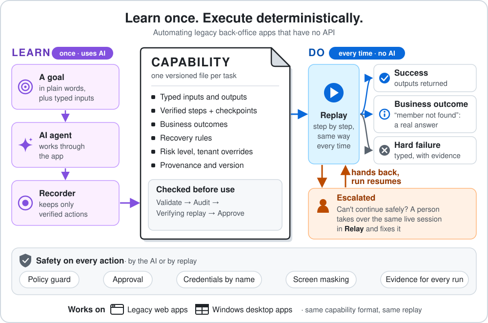

# Capability runtime for legacy back-office apps

<p align="center"></p>

Much back-office work still happens on screens with no API, such as a web workstation built from framesets and table layouts or a Windows desktop app from the early 2000s. This runtime automates those apps, in a browser and on the Windows desktop.

It works in two modes:

- **Learn.** A language model gets a goal in plain words, such as "look up member 12345 and read their savings balance". It works through the app the way a person would, reading the screen and operating the controls. The runtime records the steps that worked as a **capability**, a typed, versioned JSON file.
- **Do.** After that, the capability replays the same way every time, with no model. Each run ends in one of four typed results. If a run cannot continue safely, it hands the live session to a person, who fixes the problem and hands it back.

Validation, a risk audit, approval and a record of every run are built in, along with Relay, the console where a person takes over. The targets are two mock credit-union apps built to be hard to automate: a web workstation with two tenants, injectable faults and seeded chaos, and a Windows Forms teller app. The runtime has also run on a public demo store it was never written for, and the real-model runs on all three are in [`evidence/`](evidence/README.md). The code is a TypeScript monorepo on Node 22. Tests run offline with no API key, and CI runs typecheck, lint and tests on every push.

[`REPORT.md`](REPORT.md) explains the design, and [`docs/design/`](docs/design/) has a note per module.

**Watch it run (5 minutes, web only).** It shows what the model sees on each turn and the capability it wrote. Replay then returns a balance, a "not found" and an app error. Last, a session expires mid-run, and a person in Relay signs in again in the same browser and hands the run back.

https://github.com/user-attachments/assets/2302ddd5-fb06-4bc3-a08a-f07282ed8fa2

<details><summary><b>Terms used below</b></summary>

- **Capability.** The unit of automation is one task in one app, such as "look up a member's savings balance". It is a JSON file with typed inputs and outputs, steps, checkpoints, business outcomes, recovery rules, a risk level, per-tenant overrides, where it came from, and an approval status (`draft`, `approved`, `deprecated`).
- **Step and target.** A step is one action on a target: a click, typing into a field, a key press, a navigation or reading a value. A target is an ordered chain of locators: role and name, label, visible text, position relative to an anchor text, CSS, bounding box, and on desktop the native automation id. Replay uses the first locator that finds exactly one element. How far down the chain it had to go is the **drift** signal every run reports.
- **Checkpoint.** A condition that must hold before or after a step, such as "the text Savings is visible" or "the URL names this member". Replay waits for it instead of sleeping for a fixed time.
- **Business outcome.** An answer from the app that is neither success nor failure, such as "member not found". A capability declares each one with a detector, and replay returns it as a typed result with its own data.
- **Surface.** The adapter that sees and acts on an app. There are two: Chromium for web apps, and Windows UI Automation for desktop apps. Both share all other runtime code.
- **Escalation.** Pausing a run and handing its live session to a person through **Relay**, the operator console.

</details>

## How it is built

The runtime is one Node process, built as ports and adapters. `packages/core` holds all the decision logic: the capability schema and validator, the discovery agent and recorder, replay, the optimizer, the policy guard with the masking rules the surfaces apply, the session broker that tracks who holds control, and the evidence logger. Core has no browser, Windows or model code. It reaches the outside world through five interfaces, called ports, and each port has its own adapter package:

| Port | What it is for | Implementations |
|---|---|---|
| `Surface` | Seeing and acting on an app | Chromium (`adapter-playwright`), Windows UI Automation (`adapter-desktop`), an in-memory fake for tests |
| `LlmClient` | The model that learns a capability. Discovery only | Claude (`adapter-anthropic`), a scripted model for tests |
| `RiskJudge` | Asking whether an action commits something | Claude, Jev (`adapter-jev`) |
| `CredentialProvider` | Turning credential names into values for one run | Environment, file, helper process (`adapter-credentials`) |
| `EscalationHandler` | Bringing a person in | The session broker, with Relay as its console; scripted operators for tests |

`apps/cu` reads the flags and the policy file and plugs one adapter into each port.

<p align="center"></p>

Lint enforces the dependency direction: core imports no other package in the repo, and an adapter imports only core (the web adapter also imports the in-page agent). See [dependency direction](docs/design/architecture.md#dependency-direction). Because core talks only to ports, its tests run against an in-memory surface, and most tests need neither a browser nor Windows.

Adding the desktop surface took one new locator kind (`automation_id`) and no new action type, condition or result kind ([mapping](docs/design/desktop.md#mapping-onto-the-artifact-vocabulary)). The two surfaces differ in where their code sits. On the web, a small agent runs inside the page. On Windows, a bridge runs beside the app and nothing runs inside it.

<details><summary><b>The in-page agent (web)</b></summary>

The runtime adds a small script to every document before the page's own scripts run, or reuses a copy the app ships as a `<script>` tag. It names legacy controls, lists elements across framesets, and records a person's clicks during a handoff.

- The agent runs inside the page because a web page's structure and events live in the page's own JavaScript. It needs that access to name a legacy control from the table cell next to it, to list elements across nested framesets with a frame path for each, and to record a person's clicks in every frame during a handoff. [surface.md](docs/design/surface.md#the-in-page-agent-injected-or-included)
- An app can also ship the same file as a `<script>` tag, the way it ships a monitoring tag. The mock web app does this in every frame. The runtime then reuses the app's copy instead of adding a second one, and the observations match those of a page without the tag. [`agent-modes.test.ts`](packages/adapter-playwright/src/agent-modes.test.ts)
- Each run logs which copy it used (`source: app`, `injected` or `none`), told apart by a marker on the runtime's own copy. A page can fake the marker, so the runtime records it but does not trust it. [browser-agent.md](docs/design/browser-agent.md#integration-in-this-repo)
- The runtime uses a page's copy only if it has the same major version and is no older; otherwise it installs its own, and an active capture moves to it. If the page pins a copy the runtime cannot use, observation fails with `AgentVersionError` instead of returning an empty screen. [install rules](docs/design/browser-agent.md#install-versioning-and-idempotency), [`install.test.ts`](packages/browser-agent/test/install.test.ts)
- The agent lists controls first, then legacy label and value cells and messages, then every other block of text. The text group exists because a price in a plain `<div>` on the public store had no reference the model could read. The list holds at most 150 elements across all frames, keeps a third of the places for text, and puts on-screen elements first. [the cap](docs/design/browser-agent.md#the-cap)
- The bundle has a 48 KB limit and is 44.7 KB today. It adds one attribute to `<html>` and a hidden global, uses no `eval` or `innerHTML`, cuts every string at 300 characters, and never reads a field's value during capture. The runtime treats everything the agent returns as untrusted page data. [security posture](docs/design/browser-agent.md#security-posture)

</details>

<details><summary><b>The bridge (desktop)</b></summary>

A C# bridge in its own process reads and operates the app through UI Automation and the app's own window messages. It never takes the mouse, keyboard or focus, and it acts only on the process tree it launched or attached to.

- UI Automation is an operating-system service that already lets one process read and operate another process's controls. So the runtime runs a bridge beside the app and puts nothing inside it. Code inside a native app would need a hook for its UI toolkit or injected code, which security teams block. Before targeting a real app, open it in Accessibility Insights for Windows or Inspect.exe and check that the controls the task needs have a role and a name or an automation id. [limits](docs/design/desktop.md#limits)
- The bridge uses the native COM interface (`CUIAutomation8`), because the managed .NET client reports every Windows Forms control as an unnamed pane. The COM interface reports control types, names, automation ids and password flags. Windows ships no .NET wrapper for it, so on first run the bridge generates one with .NET's `TypeLibConverter`, with no SDK. It caches the build per user and loads it only if the file's owner and SHA-256 hash check out; a test plants a fake DLL and checks that the bridge rebuilds it. [decisions](docs/design/desktop.md#decisions)
- The bridge never moves the foreground window and never sends global mouse or keyboard input. Two UI Automation calls broke that rule, and the bridge replaces them with the app's own window messages. `Invoke` on a Windows Forms button runs the click handler inside the call, so a handler that opens a modal dialog blocks every later request; the bridge posts the button's `BN_CLICKED` message instead. `SetValue` on a Win32 text box brought the app to the front when measured; the bridge sends `WM_SETTEXT` instead. A static scan forbids the input and activation APIs, and every Windows integration test checks afterwards that no app it started has the foreground. [`no-global-input.redteam.test.ts`](packages/adapter-desktop/src/no-global-input.redteam.test.ts)
- The bridge acts only on the process tree it launched or attached to. It filters windows by process before it creates any UI Automation element, and every tree walk admits only those processes. It tracks each process by id and start time, so it never adopts a recycled id. It never reads a window from another program placed inside the app, and paints that window over in screenshots. A test checks this with a second copy of the app. [`mock-desktop.integration.test.ts`](packages/adapter-desktop/src/mock-desktop.integration.test.ts)
- The bridge takes ownership of an app only after proving the app is its own. It puts a launched app in a Windows job object, which ends the app when the bridge exits, even if `cu` crashes. First it checks that the app is the runtime's own child and started no more than 60 seconds before the launch, which keeps unrelated processes out of the job. An app the runtime attached to is never ended. A launched app receives a short allowlist of Windows environment variables, with no model key and no credentials. [`launch.test.ts`](packages/adapter-desktop/src/launch.test.ts)
- The bridge itself does little. It lists windows and elements, makes one UI Automation call, posts one message, or captures one window with `PrintWindow` and paints over the fields the surface names. It never receives typed values and never reads a password field. Locators, labels, conditions, masking rules, and turning UI Automation events into value-free records of what a person did are written in TypeScript and tested on any OS against a [fake bridge](packages/adapter-desktop/src/fake-bridge.ts).

</details>

## Learn and Do

### Learn: `discover`

`cu discover` takes a goal, declared inputs with example values, and the outputs it should read. Four parts do the work:

- **The agent** (`packages/core/src/agent`) runs a loop with a model (Claude, through `packages/adapter-anthropic`). Each turn it observes the app (a screenshot, a list of the controls and text on screen, and a text digest) and calls exactly one tool: `click`, `type`, `select`, `press`, `navigate`, `dismiss_dialog`, `dismiss_interstitial`, `extract`, `declare_outcome`, `done` or `stuck`. It names elements by a reference from the observation, not by screen coordinates, and each action says what it expects to see next.
- **The recorder** turns each accepted action into a step. It keeps only locators that find the element alone on the live screen, records the agent's verified expectation as the step's checkpoint, replaces input values with placeholders (`{input.memberId}`), and never stores a value read from the screen. A target in the record that an input names keeps no positional locator. The capability is written with status `draft`.
- **The policy guard** checks every action against an allowlist of origins, paths and action types. An action the policy marks irreversible ("Submit", "Transfer") needs a person's confirmation in Relay before it runs.
- **The risk judge** asks a small model whether a committing action the patterns let through really commits, such as a "Continue" that sends a transfer. A step it raises is written into the capability as irreversible. It runs at record and audit time, never during replay.

### Do: `replay`

`cu replay` runs a capability with typed inputs. It has no model client. For each step, replay checks recovery triggers (a known maintenance notice it can dismiss), waits for the precondition, asks the policy guard, resolves the target, acts, and then waits for the postcondition and the business-outcome detectors together.

Every run ends in one of four results:

| Result | Meaning | Exit code |
|---|---|---|
| `success` | Outputs returned. | 0 |
| `business_outcome` | A declared outcome, such as `member_not_found`, with its data. | 3 |
| `hard_failure` | A code from a closed set (`element_not_found`, `checkpoint_failed`, `app_error`, `policy_violation`, `input_validation`, ...), the step, what was expected and what was observed, and once the app is involved, a screenshot and a page or tree snapshot. | 4 |
| `escalated` | A person was brought in; the result records how they resolved it and what the run returned afterwards. | 5 |

Replay escalates on an expired session, an unexpected dialog, or a step marked `onFailure: escalate`. Relay shows the queue, the screenshot and the reason. A person takes control of **the same live session** (the same browser window or desktop app), fixes the problem, for example by signing in again, and hands it back. The run checks where it is and continues.

A capability with an irreversible step runs that step only if the capability is `approved` (`replay --approve` lifts this for one run, in memory). `cu approve` promotes a draft only when a completed replay of that same version is on record under `runs/`, and if that replay recorded a content digest, it must match the file.

### A capability's life

| Stage | Command | What happens |
|---|---|---|
| Learned | `cu discover` | The agent finds a path; the recorder writes a `draft`. |
| Extended | `cu discover --extend` | Optional. Probes other inputs and adds business outcomes, as a new draft minor version ([run 1](evidence/discovery-extend-1/), [run 2](evidence/discovery-extend-2/)). |
| Checked | `cu validate`, `cu audit` | Schema and cross-field checks with warnings; `audit` re-judges every committing action with the risk judge. |
| Shortened | `cu optimize` | Optional, read-only capabilities only. Writes a new draft. |
| Verified | `cu replay` | A replay of the exact file, recorded under `runs/`. |
| Approved | `cu approve --by <name>` | Status becomes `approved`, patch version bumped. Irreversible steps may now run. |
| Used | `cu replay`, `cu catalog invoke` | Deterministic runs. The catalog lets another agent find and call capabilities ([below](#capabilities-as-tools-for-ai-assistants)). |

A capability targets an app product rather than a single installation. Differences between tenants (a renamed label, an extra field, a different frame shell) go in per-tenant overrides inside the capability, chosen with `--tenant`. Overrides may patch targets and add steps, but not irreversible ones.

## What sets it apart

The usual way to automate a screen-only app is to let a model click through it, save the clicks as a script and replay the script. Nothing in that approach stops a run from acting on the wrong member's record, behaving differently each time, sending an irreversible action twice or showing customer data to a model. This runtime has a guard for each. Open a claim to see how it works and the test or recorded run that pins it.

<details><summary><b>1. An ambiguous match stops the run instead of picking a record by position.</b></summary>

At record time, a target that belongs to the record an input names (a result row, a balance cell) keeps no CSS or bounding-box locator, and every locator that is kept must find the element alone on the live page or it is dropped. At replay, the runtime refuses a positional fallback when a naming locator matched several elements, and it does not read from a position while the target has a locator that names it. Both end as a typed `element_not_found`.

Proof: [`tests/e2e/positional-fallback.redteam.test.ts`](tests/e2e/positional-fallback.redteam.test.ts), [`tests/e2e/record-membership.test.ts`](tests/e2e/record-membership.test.ts), [`tests/e2e/discover-lastname.test.ts`](tests/e2e/discover-lastname.test.ts)

</details>

<details><summary><b>2. Replay has no model, and a test fails if one is wired in.</b></summary>

The model is used once, to learn a capability. A static scan covers replay, the optimizer, the session broker, policy, surface, evidence and schema code. It fails if any of them imports the agent or a model adapter, names a model vendor's host, reads a model key, or loads a module by a computed name. It also walks the import graph from replay's entry points, and allows the model SDK in one package only.

Proof: [`packages/core/src/replay/no-llm.redteam.test.ts`](packages/core/src/replay/no-llm.redteam.test.ts)

</details>

<details><summary><b>3. Every run ends in one of four typed results, and "member not found" comes back as data.</b></summary>

A run returns `success`, `business_outcome`, `hard_failure` or `escalated`. A hard failure carries a code from a closed set of eleven, the step, what was expected and what was observed, and, once the app is involved, a screenshot and a page snapshot. Extend mode runs discovery again with another input to find and declare outcomes such as "member not found" and "access denied", which replay then returns with their data.

Proof: [`tests/e2e/replay-outcomes.test.ts`](tests/e2e/replay-outcomes.test.ts), recorded runs [not found](evidence/replay-not-found/) and [access denied](evidence/replay-access-denied/)

</details>

<details><summary><b>4. An irreversible step runs only in an approved capability, and approval needs a replay of that exact file.</b></summary>

The policy marks irreversible controls. A risk judge (two implementations, Claude and Jev) asks whether an action the patterns let through really commits, such as a "Continue" that sends a transfer. It runs at record and audit time, never at replay. A judgment can only raise risk, and by default an unavailable judge counts as "irreversible". `cu approve` refuses unless a recorded replay's content digest matches the file. On a labelled set of 27 actions, both judges caught all 11 irreversible ones with no false positives.

Proof: [`packages/core/src/agent/risk-judge.redteam.test.ts`](packages/core/src/agent/risk-judge.redteam.test.ts), [`apps/cu/src/commands/approve.test.ts`](apps/cu/src/commands/approve.test.ts), [judge runs](evidence/followups/risk-judge/)

</details>

<details><summary><b>5. A person takes over the same live session, and resuming never repeats or skips an irreversible step.</b></summary>

The operator works in the same browser window or desktop app; automation cannot act while they hold control. After a lost session, a retry resumes at the first step after sign-in, and Relay lists the steps that will run again before the hand-back. A resume point that would repeat or skip an irreversible step, including one the person completed by hand, is refused and the person is asked again. Idle control is reclaimed after 15 minutes without a heartbeat, and what the person did is recorded as clicks and field names, without values.

Proof: [`packages/core/src/replay/replay-resume-at.test.ts`](packages/core/src/replay/replay-resume-at.test.ts), [`tests/e2e/replay-human-retry.test.ts`](tests/e2e/replay-human-retry.test.ts), [rewind rules](docs/design/replay.md#resuming-at-another-step-rewindts), [recorded handoff](evidence/replay-handoff/)

</details>

<details><summary><b>6. The model, the evidence and the operator console all see the screen through one mask, applied at the surface.</b></summary>

Policy rules paint over form fields, values next to listed labels (address, phone, tax id), text patterns and the run's own input values before a screenshot or page text leaves the surface. The runtime can still read a value the model never saw. It returns the value to the caller marked sensitive and redacts it wherever it is stored. A seeded fuzzer generates pages, changes them during capture, and fails on a single PII-coloured pixel or PII string.

Proof: [`packages/adapter-playwright/src/screen-mask-fuzz.redteam.test.ts`](packages/adapter-playwright/src/screen-mask-fuzz.redteam.test.ts), [`packages/core/src/replay/sensitive-output.redteam.test.ts`](packages/core/src/replay/sensitive-output.redteam.test.ts), [screen-masking.md](docs/design/screen-masking.md)

</details>

<details><summary><b>7. On Windows, the runtime acts only inside the app's own windows, so a person can keep using the machine.</b></summary>

The desktop surface uses UI Automation patterns and window messages addressed to the app. A static test fails if the adapter or the mock app calls anything that synthesizes global input or takes the foreground, and the bridge refuses any window outside the process tree it launched or attached to. It uses the same capability format, replay engine, policy and Relay as the web surface.

Proof: [`packages/adapter-desktop/src/no-global-input.redteam.test.ts`](packages/adapter-desktop/src/no-global-input.redteam.test.ts), [scope decisions](docs/design/desktop.md#decisions), [live desktop run](evidence/followups/discovery-desktop/)

</details>

<details><summary><b>8. It is tested against an app built to resist automation, and against a site it was not written for.</b></summary>

The mock workstation uses framesets, table layouts, div buttons, span tabs and no test IDs, with injectable faults and seeded chaos: the same seed gives the same fault series, and the CLI prints the command that reproduces it. A flexbox shop fixture checks that discovery is not tailored to tables. The first run against a public demo storefront failed because a price in a plain `<div>` had no element reference. Element listing was generalised, and the run then passed, including a typed failure for an unlisted product.

Proof: [`docs/design/mock-app.md`](docs/design/mock-app.md), [`tests/e2e/replay-chaos.test.ts`](tests/e2e/replay-chaos.test.ts), [`tests/e2e/discover-storefront.test.ts`](tests/e2e/discover-storefront.test.ts), [public-target run](docs/design/public-target.md)

</details>

## How it handles LLM risks

Hallucination, unsafe actions, token cost, retries and prompt injection are the usual worries about putting a model near a back-office app. The model is used only to learn. It can act only on controls the runtime lists, every action it takes passes the policy guard, and replay, which handles the volume, uses no tokens. [LLM risks](docs/llm-risks.md) covers each concern, with what the runtime does about it and the test or recorded run that shows it.

## Surfaces: web and desktop

The `--base-url` scheme picks the surface (`apps/cu/src/runtime/compose.ts`): `desktop://<process>` composes the desktop surface, anything else Chromium.

| | Web | Desktop |
|---|---|---|
| Addressed by | `--base-url http(s)://...` | `--base-url desktop://<process name>`, plus `--app-command "<command line>"` to start the app or `--attach-pid <pid>` to drive a running one |
| Adapter | `packages/adapter-playwright` drives Chromium | `packages/adapter-desktop` drives the app through Windows UI Automation (UIA) |
| Perceives | A screenshot plus the controls, label/value cells and text blocks of every frame, read by the in-page script | The app's UIA tree plus screenshots of the app's own windows (`PrintWindow`). No OCR |
| Acts | Playwright clicks, fills and key presses in the page | UIA patterns, and window messages to the app's own windows (a posted `BN_CLICKED`, `WM_SETTEXT`, posted key messages). No global mouse or keyboard input, and it does not take the foreground |
| Code next to the app | `@cu/browser-agent`, a script inside the page (`window.__cuAgent`), injected by the runtime or shipped by the app as a `<script>` tag | A C# bridge in a `powershell.exe` child process the runtime starts, talking JSON lines over stdin/stdout. Nothing runs inside the app |
| Locators | role, label, text, relative, css, bbox | role, label, text, relative, bbox, automation_id (a css locator always misses) |
| During a handoff | Listeners in every frame record clicks and which field was typed into | UIA events on the app's windows record the same facts |
| Screen masking | The policy's `redaction.screen` rules, including CSS selectors | The same rules except CSS selectors; password fields are never read |
| Where it runs | Any OS that runs Chromium; the app only has to be reachable | Windows. Runtime, bridge and app on the same machine, in the same signed-in session, at the same elevation level |
| Reach | Anything in the DOM, including framesets, table layouts and div buttons | Whatever the app's UI toolkit exposes to UIA. Win32, Windows Forms and WPF expose good trees |
| Mock target | CU Core Workstation (`apps/mock-app`), two tenants, injectable faults | Teller Workstation (`apps/mock-desktop`), Windows Forms |

[Learn and Do on Windows, step by step](docs/windows-walkthrough.md) follows one desktop discovery and its replays. It shows the bridge protocol, what the model saw and called on each turn, the masked screenshots it received, the step it wrote, and how replay ends for a known and an unknown member.

## Features

Each group opens to a list, with a link per item to its design note, test or recorded run.

<details><summary><b>Learning</b>: several candidates, a replay-verified optimizer, <code>cu audit</code></summary>

- `discover --candidates n` learns a read-only goal n times. It keeps the verified candidate with the fewest steps, but only if every candidate returned the same outputs; otherwise it keeps them all for a person to choose. [optimize.md](docs/design/optimize.md#discover)
- The optimizer removes a step only after replay shows the capability still works without it. It replays variants only of a capability declared read-only, always writes a draft that names each removed step, and runs its trials on the desktop surface too. On the shipped capability it cut 10 steps to 9. [design](docs/design/optimize.md), [runs](evidence/followups/optimizer/)
- `cu audit` asks the risk judge again about every committing step and recovery action in an existing capability, and exits 2 if any is riskier than declared. `npm run judge:eval` runs the labelled cases through either judge and prints the confusion matrices and each miss. [cu audit](docs/design/risk-judge.md#cu-audit), [runs](evidence/followups/risk-judge/)

</details>

<details><summary><b>Running</b>: drift and tenant overrides, recovery rules, the read-only retry, re-login, <code>cu validate</code>, stability runs</summary>

- Replay reports how far down each locator chain it had to go, and a tenant override closes the gap. Tenant B renames "Member ID" to "Member #": without its override the step resolves at depth 2, with it at depth 0. [without](evidence/replay-tenant-b-no-override/), [with](evidence/replay-tenant-b/)
- Recovery rules sit apart from the steps. Replay dismisses a known interruption, such as a maintenance notice, wherever it appears, up to a per-run limit, and lists it in the result; the steps stay the same. In six chaos runs the notice rule fired 10 times. [runs](evidence/followups/chaos/)
- On a run declared read-only, replay retries an app error it reads from the page by restarting from a navigation step, at most twice. Replay refuses that declaration on any capability with an irreversible step. [test](tests/e2e/replay-app-error-retry.test.ts), [runs](evidence/followups/retry/)
- The scripted re-login uses the capability's `auth` block, written by hand or derived from the recorded sign-in steps. It signs in again after an expired session and resumes at the first step after sign-in. [credentials.md](docs/design/credentials.md#the-auth-block-and-generic-re-login)
- `cu validate` checks a capability's fields against each other. It warns about a read that only a position can find, an outcome detector that an emptied form could satisfy, and a repeated step. [tests](packages/core/src/schema/validate.test.ts)
- `replay --times N` reports results by kind, recoveries and fallback depths. With a seeded chaos series, it found a wrong answer, since fixed. After a lost session, replay re-ran only the search on an emptied form and reported "member not found" for a member who exists. [test](tests/e2e/replay-times.test.ts), [runs](evidence/followups/chaos/)

</details>

<details><summary><b>People in the loop</b>: Relay, handoffs during discovery, scripted operators</summary>

- Relay, the operator console, lists each intervention with its reason, step, expected and observed state, and a screenshot. Taking control starts a lease, which the console renews with a heartbeat every 5 seconds. While the operator holds control, a live screenshot refreshes about once a second through the same mask, and their clicks appear as they happen. Updates arrive as server-sent events, and a client that reconnects receives the ones it missed. Relay refuses any request whose Host, Origin or Sec-Fetch-Site header points somewhere other than its own loopback address, and serves the page under a strict content security policy. [relay.md](docs/design/relay.md), [tests](apps/relay/test/server/console.redteam.test.ts)
- Discovery also hands over to a person when the agent says it is stuck, repeats a failing action three times, or wants an irreversible action confirmed. [handoff.md](docs/design/handoff.md#how-stuck-is-detected)
- Three scripted operators (`approve`, `abort`, `relogin`) stand in for a person in tests and unattended runs, and every record marks them as scripted.

</details>

<details><summary><b>Safety</b>: credentials by name, origin allowlist, prompt injection, the security review</summary>

- A capability stores only credential names. A run resolves them from the environment, a file, or a helper process that prints JSON, which is enough to put a vault CLI behind it. The runtime refuses a credentials file inside a git work tree unless git ignores it, and no failure message quotes a value. A test limits `process.env` reads to an allowlist. [credentials.md](docs/design/credentials.md), [tests](packages/adapter-credentials/src/credentials.redteam.test.ts), [`process-env.redteam.test.ts`](packages/core/src/credentials/process-env.redteam.test.ts)
- The CLI refuses to start against an origin the policy does not list and limits each run to its own base URL. A redirect off the list quarantines the run. [policy.md](docs/design/policy.md)
- An instruction planted in the page cannot take the agent off the allowlist. In a test, a scripted model that obeys one is still stopped by the policy guard before the surface acts. [test](packages/core/src/agent/prompt-injection.redteam.test.ts)
- The security review lists 44 attacks, and a red-team test next to the code under attack pins each fix. [security-review.md](docs/design/security-review.md)

</details>

## Capabilities as tools for AI assistants

A chat or voice assistant can use capabilities as tools: it picks an approved task and supplies the inputs, and the runtime runs it. `cu catalog` does this for a directory of capability files:

- `catalog search "<text>"` ranks capabilities with a standard keyword formula (BM25F) over id, name, description, inputs, outputs, outcomes and app details, and shows which fields matched. It uses no model and no embeddings, so a query always returns the same order.
- `catalog tools` prints tool definitions in the Anthropic tool-use format. `--brief` prints one line per capability for a first pass, `--id` prints one full definition, and `--query` prints full definitions for a search shortlist. `--approved-only` leaves out drafts.
- `catalog invoke <id> --input name=value` replays the capability the same way `cu replay` does, with the same four results and exit codes.

<details><summary><b>Example tool definition</b>, with the description shortened</summary>

```json
{
  "name": "lookup-member-savings-balance",
  "description": "Signs on to the CU Core Workstation, searches for a member by memberId, opens their profile, and returns their name and current savings balance. Outputs -- memberName (string): ... Business outcomes -- member_not_found (...); access_denied (...). Risk: read.",
  "input_schema": {
    "type": "object",
    "properties": {
      "memberId": {
        "type": "string",
        "description": "The credit union member's numeric member ID, as printed on their account documents.",
        "pattern": "^[0-9]{5}$"
      }
    },
    "required": ["memberId"],
    "additionalProperties": false
  }
}
```

</details>

The input schema comes from the capability, so a bad value returns a typed `input_validation` failure before the app is touched ([`tests/e2e/catalog.test.ts`](tests/e2e/catalog.test.ts)). The assistant's model chooses the tool and its arguments, and replay runs it without a model.

## Quickstart

You need Node 22 and npm. Install, then start the mock web app in one terminal:

```bash
npm install
npx playwright install chromium
npm run mock-app
```

In a second terminal, replay the shipped, approved capability. No key is needed:

```bash
# success, exit 0
npm run --silent replay -- artifacts/lookup-member-savings-balance.json --input memberId=12345
# business_outcome member_not_found, exit 3
npm run --silent replay -- artifacts/lookup-member-savings-balance.json --input memberId=99999
```

Only `discover`, `cu audit` and the risk-judge eval call a model and need a key (`ANTHROPIC_API_KEY`). Replay and every test run without one. [Getting started](docs/getting-started.md) covers setup, learning a task on the web, a real human handoff, the desktop demo on Windows, Windows PowerShell quoting and the tests. A policy file and a few environment variables configure a run; [the reference](docs/reference.md#configuration) lists them, with every command, flag and exit code.

## What's next

The runtime works end to end on one machine. These are the next pieces of work:

- **Learning from people.** A person does the task once while the runtime watches, and the recording goes through the same recorder, checks and approval as a model-learned capability. Both surfaces already capture what a person does without reading values. Still to build are a `cu record` command and the step builder. Passive capture across many desks would show which tasks to automate first. [The proposal](docs/roadmap.md#proposed-learning-from-people-first)
- **Running at scale.** Relay reachable off the machine with single sign-on, runs and capabilities in a database and object store, and a pool of workers fed from a queue, with a Windows session per concurrent desktop run. [Path to production](docs/roadmap.md#path-to-production)
- **A capability selector for assistants.** A small model call that reads the one-line briefs, picks an approved capability and fills its inputs, and asks a person to confirm before anything irreversible runs. [Design](docs/design/capability-selection.md)
- **Proving read-only.** A capability's `readOnly` flag is set by its author, and the optimizer and the app-error retry trust it. Checking the flag against what the app actually did would remove the need for that trust.
- **Masking beyond the page structure.** Text drawn inside images or canvas has no element for a masking rule to name. OCR over the screenshot would cover it.
- **Wider desktop reach.** Older toolkits such as VB6, Delphi and PowerBuilder expose little to UI Automation. An MSAA fallback and OCR would reach more of them, and the same bridge protocol could drive macOS through its Accessibility API.

[The roadmap](docs/roadmap.md) has the nine steps to production in order and the rest of the planned work.

## Further reading

- [Getting started](docs/getting-started.md): setup, the web and desktop demos, a real human handoff, and the tests.
- [Learn and Do on Windows, step by step](docs/windows-walkthrough.md): one desktop run, turn by turn.
- [LLM risks](docs/llm-risks.md): hallucination, guardrails, token cost, retries and abuse.
- [Command and configuration reference](docs/reference.md): every command, flag, exit code, policy field and environment variable.
- [Roadmap](docs/roadmap.md): path to production and planned work.
- [Repo layout and evidence](docs/repo-layout.md): where the code lives and what the recorded runs hold.
- [`REPORT.md`](REPORT.md): the reasoning behind the design.
- [`docs/`](docs/README.md): a design note per module.

## License

Source-available under the PolyForm Noncommercial License 1.0.0 (see [`LICENSE`](LICENSE)). You may read, run and modify it for personal and other noncommercial purposes, and evaluate it. Commercial use needs a separate paid license; see [`LICENSING.md`](LICENSING.md).
