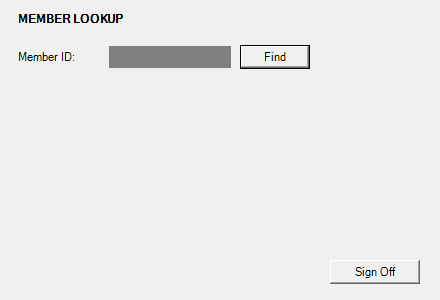
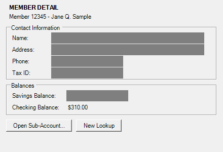

# Learn and Do on Windows, step by step

This follows the desktop evidence run in [`evidence/followups/discovery-desktop/`](../evidence/followups/discovery-desktop/): one discovery of "sign on to the Teller Workstation, look up member {memberId} and read their savings balance" (7 steps, 7 model calls), then replays of the capability it wrote. The commands are in the [desktop demo](getting-started.md#desktop-the-same-on-teller-workstation-windows). The root [README](../README.md#surfaces-web-and-desktop) compares the desktop surface with the web one.

```
cu (one Node process)                bridge (powershell.exe -MTA, C#)        app
 | policy lists desktop://tellerworkstation? yes, run narrowed to it
 |-- start ------------------------->| compile UiaBridge.cs (Add-Type)
 |-- spawn from --app-command, minimal environment ----------------------------->| starts
 |-- attach {pid, killOnClose} ----->| cu's own child? put its tree in a kill-on-close job
 |   then per model turn (discover) or step (replay, which screenshots only for evidence):
 |-- snapshot ---------------------->|-- UIA tree of the app's windows --------->|
 |-- screenshot {fields to paint} -->|-- PrintWindow per window, paint fields -->|
 |-- act {setValue|invoke|key} ----->|-- WM_SETTEXT | BN_CLICKED | WM_KEYDOWN -->|
 |-- close ------------------------->| exits; a launched app is ended ---------->X
                          one JSON object per line over stdin/stdout
```

## Start

`cu` refuses to start unless the policy (`policies/desktop.yaml`) lists `desktop://tellerworkstation`. It starts the bridge, then starts the app itself from `--app-command` with a minimal Windows environment, and asks the bridge to attach. With `--attach-pid` the bridge binds to the running process and owns nothing. [The desktop design note](design/desktop.md#decisions) lists the checks it makes either way.

## Learn, one model turn

1. *Observe.* The surface turns the bridge's UIA snapshot into elements: a role from the control type (Edit is `textbox`, Button is `button`), the UIA name, a label from `LabeledBy` or else the nearest static text to the left or above, the automation id, and each named group box as a frame. The bridge captures each of the app's own windows and paints over the fields the surface names (every edit field, under the desktop policy). The model gets that screenshot, the element list with refs, and the window text, with masked values shown as `[MASKED]`. Automation ids go into each element's locator chain, not into the text the model reads.
2. *Decide.* The model calls one tool with a ref, a `why` that becomes the step name, and an `expect` text.
3. *Act.* The policy guard checks the action, and checks it again on the resolved control just before the bridge acts. The bridge posts the window message or makes the UIA call described in [the desktop design note](design/desktop.md#decisions), and posts key messages for keys. The surface then waits 200 ms for the app to settle.
4. *Record.* The recorder keeps the locators that find the element alone on the live screen, keeps the `expect` text as the step's postcondition only if it became visible in what the model could see, and stores the input name or credential name, never the value.

Two turns from the run:

| | s05 "Enter the member ID to look up" | s06 "Search for the member record" |
|---|---|---|
| The model saw | `[e1] textbox "Member ID" value=""` | `[e2] button "Find"`, with e1 now `value="[MASKED]"` |
| The model called | `type` on e1 from input `memberId`, expect `12345` | `click` on e2, expect `Savings` |
| The bridge did | `WM_SETTEXT` to the edit's own window | posted `BN_CLICKED` to the button's parent window |
| What followed | The field is masked, so `12345` never showed: expectation not met, no checkpoint recorded | The window became "Teller Workstation - Member 12345" and `Savings` appeared: recorded as the postcondition |
| Locators kept | label `Member ID`, right of `Member ID:`, bbox. No automation id (the control has none) and no role+name: Win32 announces this box as "Invalid user ID or password.", which disagrees with its label | role `button` named `Find`, text `Find`, bbox |

| After s05 | After s06 |
|---|---|
|  |  |

These are the screenshots the model received. Every edit field is painted over. Static text is not, so the header with the fictional member's name and the checking balance (left visible on purpose by the desktop policy) still show.

The sign-on step as written to [`capability.json`](../evidence/followups/discovery-desktop/capability.json), trimmed:

```json
{ "id": "s04", "name": "Sign on to the Teller Workstation",
  "action": { "type": "click", "target": { "description": "button \"Sign On\" (button)", "locators": [
    { "strategy": { "kind": "automation_id", "id": "btnSignOn" }, "confidence": 0.95, ... },
    { "strategy": { "kind": "role", "role": "button", "name": "Sign On", "exact": true }, ... },
    { "strategy": { "kind": "text", "text": "Sign On", "exact": true, "tag": "button" }, ... },
    { "strategy": { "kind": "bbox", ... }, ... } ] } },
  "postcondition": { "kind": "text_visible", "text": "Member Lookup", "frame": [] },
  "risk": "reversible" }
```

The file says `"surface": "desktop"` and `"entryUrl": "{baseUrl}"`. The `desktop://` location comes from the run's `--base-url`, and step s01, a `navigate` to it, waits for the app's main window rather than opening anything.

## Do, with no model

`cu replay` starts the bridge and launches or attaches to the app the same way. For each step it waits for the precondition if there is one, asks the policy guard, takes a fresh UIA snapshot, tries the target's locators in order, acts through the bridge, and waits for the postcondition. It reads the postcondition from the text of the app's UIA tree (titles, names, values), not from pixels.

- **Member 10002:** `success` in 7 steps and 2.9 seconds, every target found by its first locator (automation id for User ID, Sign On and Savings Balance; label for Password and Member ID; role and name for Find). The balance is the field's UIA value. The policy masks that field, so the output is marked sensitive: the caller gets 12500, while the summary line and `result.json` show `<sensitive>`.
- **Member 99999:** the app shows "No member found with ID 99999." and s06's postcondition never holds. This capability declares no outcome for that text, so the run ends `hard_failure` / `checkpoint_failed` at s06, exit 4, with a masked screenshot and the accessibility tree (names, no values) as evidence. With a `member_not_found` outcome declared, which `discover --extend` adds, the same input returns `business_outcome` (`tests/e2e/desktop.test.ts`).
- **Escalation:** Relay's live screenshot is the same masked capture of the app's own windows. A person takes over at the machine running the app, and the bridge reports from UIA events which control they clicked and which field changed, never the value. Tests cover the escalation with a scripted operator and the capture against the bridge; the evidence folder holds no desktop handoff by a person.
- **End:** the surface stops capture and ends the bridge. An app the run launched is ended with its process tree (by the job object, if `cu` dies first). An attached app keeps running.

Before pointing this at a real app, do the Inspect check described under [desktop limits](design/desktop.md#limits).
